# 1. Flutter 환경변수 설정
플러터 환경변수 영구 설정이 안 됐을 시에는 아래 링크 참고  
[윈도우 환경변수 설정](https://devlopsquare.tistory.com/3)  
[MAC 환경변수 설정](https://blog.naver.com/bluecrossing/222277992718)

# 2. Flutter 당근마켓 UI 클론 코딩 무작정 따라하기
[전체 코드](https://github.com/Ohgyuchan/carrot_clone)

## 2.1. 프로젝트 생성
* `Create New Flutter Project` 클릭
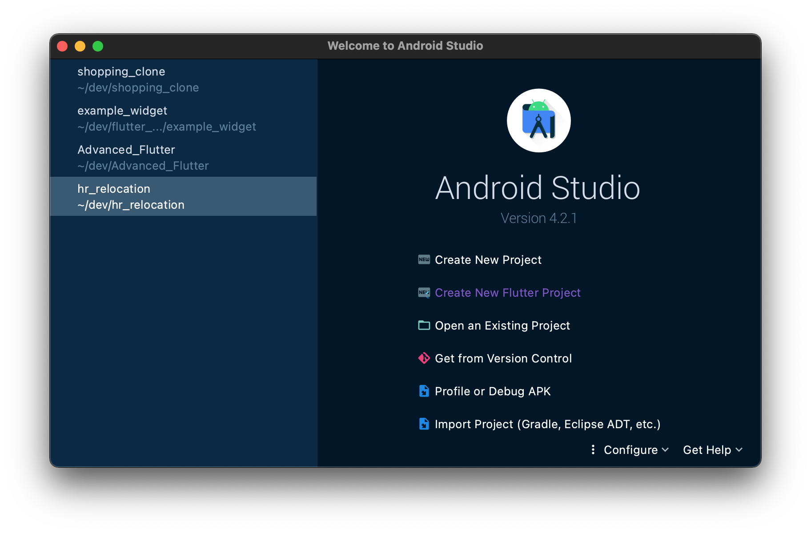
* 바로 `NEXT` 클릭
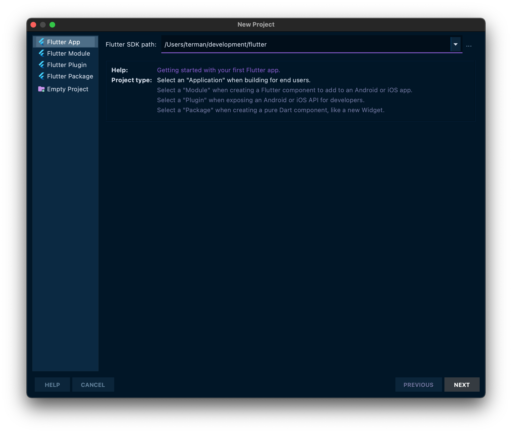
* `carrot_clone` 으로 프로젝트 이름 설정
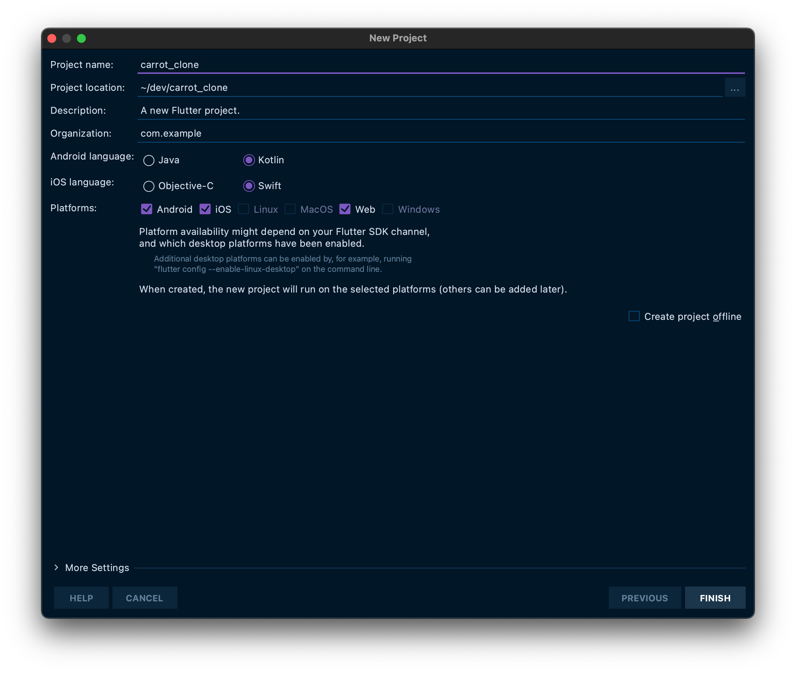
* `lib/` 에 다음 네가지 디렉토리 생성
  * `components`
  * `repositories`
  * `screens`
  * `utils`

    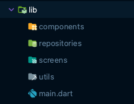

* 데이터 다운로드
  1. [data 다운로드](https://drive.google.com/file/d/1BptUxZB6FyyCk5w0WWGE0INJX7E53mV9/view?usp=sharing)
  2. 압축파일에 있는 `assets`를 `carrot_clone/` 에 assets 가져오기

  3. `lib/repository` 에 다운로드한 데이터 집어넣기
       1. `carrot_clone`
       2. `carrot_clone_data/repository/*`
  4. `flutter_secure_storage` pakage 적용
        ```
        $ flutter pub add flutter_secure_storage
        $ flutter pub get
        ```
       * `android minSDK version` 18로 변경
        > flutter_secure_storage를 쓰려면 android sdk version이 최소 18이어야 된다.
       
       * `android/app/buile.gradle` 에서 `minSkdVersion` 수정
       ```
       ...
       defaultConfig {
           // TODO: Specify your own unique Application ID (https://developer.android.com/studio/build/application-id.html).
           applicationId "com.example.carrot_clone"
           minSdkVersion 18 // Update
           targetSdkVersion 30
           versionCode flutterVersionCode.toInteger()
           versionName flutterVersionName
       }
        ...
        ```
### 2.1.1. assets 적용하기
`/pubspec.yaml`
> **Indentation** 주의
```
// 변경 전
 # To add assets to your application, add an assets section, like this:
  # assets:
  #   - images/a_dot_burr.jpeg
  #   - images/a_dot_ham.jpeg

// 변경 후
  # To add assets to your application, add an assets section, like this:
  assets:
    - assets/svg/
    - assets/images/
```
```
$ flutter pub get
```
## 2.2. BottomNavigationBar 만들기
`/lib/main.dart` 을 아래 내용으로 변경
```dart
import 'package:flutter/material.dart';

void main() {
  runApp(MyApp());
}

class MyApp extends StatelessWidget {
  
  @override
  Widget build(BuildContext context) {
    return MaterialApp(
      title: 'Carrot Clone',
      theme: ThemeData(
        primaryColor: Colors.white,
        primarySwatch: Colors.blue,
      ),
      home: Scaffold(),
    );
  }
}
```
### 2.2.1 패키지 사용하기
[패키지 설명](https://pub.dev/packages/flutter_svg)
* 패키지 다운로드
   * 방법1: 아래 명령어를 터미널에 입력.
        ```
        $ flutter pub add flutter_svg
        ```
   * 방법2: `/pubspec.yaml` 에서, NEW 주석이 달린 부분을 복붙
       ```
       dependencies:
       flutter:
           sdk: flutter
       
       flutter_svg: ^0.22.0 # NEW
       ```
   * pubspec.yaml 업데이트 적용
       ```
       $ flutter pub get
       ```
* 패키지 사용
   * `/lib/main.dart`
    ```
    import 'package:flutter/material.dart';
    import 'package:flutter_svg/flutter_svg.dart'; // NEW

    void main() {
        runApp(MyApp());
    }
    ...
    ```
### 2.2.2. BottomNavigation 만들기
* AppBar 추가
    
    `/lib/main`
    ```dart
    Widget build(BuildContext context) {
        return MaterialApp(
            title: 'Carrot Clone',
            theme: ThemeData(
                primaryColor: Colors.white,
                primarySwatch: Colors.blue,
            ),
            home: Scaffold(
                appBar: AppBar(     // 여기부터
                    title: Row(
                        children: [
                        Text('양덕동'),
                        Icon(Icons.arrow_drop_down),
                        ],
                    ),
                ),
            ),                    // 여기까지
        );
    }
    ```
* bottomNavigationBar 옵션 추가  
    `Scaffold` 위젯에 `bottomNavigationBar` 옵션을 이용합니다.
    `carrot_clone/lib/main` 
    `MyApp -> build() -> Scaffold`
    ```dart
    home: Scaffold(
        appBar: AppBar(
          title: Row(
            children: [
              Text('양덕동'),
              Icon(Icons.arrow_drop_down),
            ],
          ),
        ),
        // 여기부터
        Center(
          child: Text('body'),
        ),
        bottomNavigationBar: Container(
          height: 50,
          color: Colors.red,
        ),
        // 여기까지
      ),
    ```
    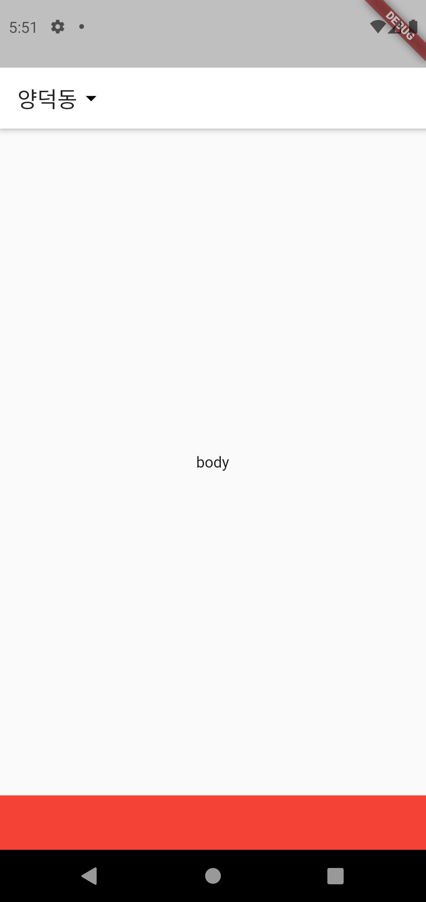
### 2.2.3. BottomNavigationBar 위젯 쓰기
`/lib/main.dart -> Scaffold(:bottomNavigationBar)` 에서 `Container` 위젯을 `BottomNavigationBar` 로 변경 
```dart
body: Center(
          child: Text('body'),
        ),
        // 여기부터
        bottomNavigationBar: BottomNavigationBar(
          type: BottomNavigationBarType.fixed,
          items: [
            BottomNavigationBarItem(
              icon: Padding(
                padding: const EdgeInsets.only(bottom: 5.0),
                child: SvgPicture.asset(
                  "assets/svg/home_off.svg",
                  width: 22,
                ),
              ),
              label: '홈',
            ),
            BottomNavigationBarItem(
              icon: Padding(
                padding: const EdgeInsets.only(bottom: 5.0),
                child: SvgPicture.asset(
                  "assets/svg/notes_off.svg",
                  width: 22,
                ),
              ),
              label: '동네 생활',
            ),
            BottomNavigationBarItem(
              icon: Padding(
                padding: const EdgeInsets.only(bottom: 5.0),
                child: SvgPicture.asset(
                  "assets/svg/location_off.svg",
                  width: 22,
                ),
              ),
              label: '내 근처',
            ),
            BottomNavigationBarItem(
              icon: Padding(
                padding: const EdgeInsets.only(bottom: 5.0),
                child: SvgPicture.asset(
                  "assets/svg/chat_off.svg",
                  width: 22,
                ),
              ),
              label: '채팅',
            ),
            BottomNavigationBarItem(
              icon: Padding(
                padding: const EdgeInsets.only(bottom: 5.0),
                child: SvgPicture.asset(
                  "assets/svg/user_off.svg",
                  width: 22,
                ),
              ),
              label: '나의 당근',
            ),
          ],
        ),
        // 여기까지
```
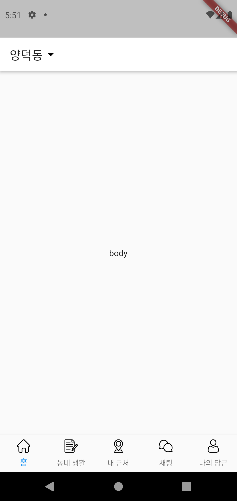

## 2.3. App Screen 만들기
프로젝트를 관리할 때 기능별로 혹은 화면(Screen)별로 *.dart 파일을 나누어 관리하는 것이 효율적입니다.  

main.dart는 앱을 시작하는 부분만을 담당하게 하고, Bottom Navigation을 포함한 화면을 전환해주는 기능을 담당하는 `AppScreen Class`를 `/lib/screens/app_screen.dart`에 따로 정의해 줍니다.  

> 앞으로 다룰 Screen들도 각 Screen 별로 dart 파일을 만들어 관리하도록 하겠습니다.

### 2.3.1. AppScreen 만들기
프로그래밍을 할 때 동일한 코드가 여러 곳에서 동시에 써야하는 일이 있습니다.

이런 경우에는 반복되는 코드를 함수나 클래스로 정의해서 관리하는 것이 유지, 보수에 효율적입니다.  

위에서는 `BottomNavigationBarItem` 위젯이 반복되기 때문에 따로 함수로 만들어 `app_screen.dart` 에 재정의 합니다.

`/lib/screens/app_screen.dart`
> `AppScreen` 클래스를 StatefulWidget으로 다음과 같이 정의합니다.
```dart
import 'package:flutter/material.dart';
import 'package:flutter_svg/flutter_svg.dart';

class AppScreen extends StatefulWidget {
  const AppScreen({Key? key}) : super(key: key);

  @override
  _AppScreenState createState() => _App_AppScreenStateState();
}

class _AppScreenState extends State<AppScreen> {
  late int _currentPageIndex;

  @override
  void initState() {
    super.initState();
    _currentPageIndex = 0;
  }

  @override
  Widget build(BuildContext context) {
    return Scaffold(
        appBar: AppBar(
                title: Row(
                    children: [
                    Text('양덕동'),
                    Icon(Icons.arrow_drop_down),
                    ],
                ),
        ),
        body: _bodyWidget(),
        bottomNavigationBar: _bottomNavigationBarWidget(),
    );
  }

  Widget _bodyWidget() {
    switch (_currentPageIndex) {
      case 0: // 홈
        return Center(
          child: Text('홈'),
        );
      case 1: // 동네 생활
        return Center(
          child: Text('동네 생활'),
        );
      case 2: // 내 근처
        return Center(
          child: Text('내 근처'),
        );
      case 3: // 채팅
        return Center(
          child: Text('채팅'),
        );
      case 4: // 나의 당근
        return Center(
          child: Text('나의 당근'),
        );
    }
    return Container();
  }

  BottomNavigationBarItem _bottomNavigationBarItem(
      String iconName, String label) {
    return BottomNavigationBarItem(
      icon: Padding(
        padding: const EdgeInsets.only(bottom: 5.0),
        child: SvgPicture.asset(
          "assets/svg/${iconName}_off.svg",
          width: 22,
        ),
      ),
      activeIcon: Padding(
        padding: const EdgeInsets.only(bottom: 5.0),
        child: SvgPicture.asset(
          "assets/svg/${iconName}_on.svg",
          width: 22,
        ),
      ),
      label: label,
    );
  }

  Widget _bottomNavigationBarWidget() {
    return BottomNavigationBar(
      type: BottomNavigationBarType.fixed,
      onTap: (int index) {
        print(index);
        setState(() {
          _currentPageIndex = index;
        });
      },
      currentIndex: _currentPageIndex,
      selectedFontSize: 12,
      selectedItemColor: Colors.black,
      selectedLabelStyle: TextStyle(color: Colors.black),
      items: [
        _bottomNavigationBarItem("home", "홈"),
        _bottomNavigationBarItem("notes", "동네 생활"),
        _bottomNavigationBarItem("location", "내 근처"),
        _bottomNavigationBarItem("chat", "채팅"),
        _bottomNavigationBarItem("user", "나의 당근"),
      ],
    );
  }
}

```
> `_bottomNavigationBarWidget` : BottomNavigationBar를 `return` 하는 함수

> `selectedFontSize`, `selectedItemColor`, 
`selectedLavelStyle` 옵션을 추가해서 선택된 `BottomNavigationBarItem` 에 효과를 줍니다.

`/lib/screens/app_screen -> _bottomNavigationBarWidget()`
```dart
Widget _bottomNavigationBarWidget() {
    return BottomNavigationBar(
      type: BottomNavigationBarType.,
      onTap: (int index) {
        print(index);
        setState(() {
          _currentPageIndex = index;
        });
      },
      currentIndex: _currentPageIndex,
      selectedFontSize: 12,
      selectedItemColor: Colors.black,
      selectedLabelStyle: TextStyle(color: Colors.black),
      items: [
        _bottomNavigationBarItem("home", "홈"),
        _bottomNavigationBarItem("notes", "동네 생활"),
        _bottomNavigationBarItem("location", "내 근처"),
        _bottomNavigationBarItem("chat", "채팅"),
        _bottomNavigationBarItem("user", "나의 당근"),
      ],
    );
  }
```

* main.dart  
    `/lib/main.dart`
    ```dart
    import 'package:carrot_clone/screens/app_screen.dart';
    import 'package:flutter/material.dart';

    void main() {
        runApp(MyApp());
    }

    class MyApp extends StatelessWidget {
        @override
        Widget build(BuildContext context) {
            return MaterialApp(
            title: 'Carrot Clone',
            theme: ThemeData(
                primaryColor: Colors.white,
                primarySwatch: Colors.blue,
            ),
            home: AppScreen(),
            );
        }
    }

    ```
    
## 2.4. Home Screen 만들기
### 2.4.1. intl pakage 사용하기
```
$ flutter pub add intl
$ flutter pub get
```
### 2.4.2. DataUtils Class 생성
`/lib/utils/data_utils.dart` 에 아래 내용 복붙
> **1000**을 **1,000**으로 포맷하는 코드입니다.
```dart
import 'package:intl/intl.dart';

class DataUtils {
    static final formatTowon = new NumberFormat("#,###", "ko_KR");
    static String calcStringToWon(String priceString) {
        if (priceString == '무료나눔') return priceString;
        return "${formatTowon.format(int.parse(priceString))}원";
    }
}
```
`/lib/screens/home_screen.dart` 에 `HomeScreen` Class 생성
```dart
import 'package:flutter/material.dart';

class HomeScreen extends StatefulWidget {
  const HomeScreen({Key? key}) : super(key: key);

  @override
  _HomeScreenState createState() => _HomeScreenState();
}

class _HomeScreenState extends State<HomeScreen> {
  @override
  Widget build(BuildContext context) {
    return Container(
      color: Colors.black,
    );
  }
}
```

`/lib/screens/app_screen.dart` `_AppScreenState -> _bodyWidget()` 수정
```dart
import 'package:carrot_clone/screens/home_screen.dart'; // NEW
...
Widget _bodyWidget() {
    switch (_currentPageIndex) {
      case 0: // 홈
        return HomeScreen(); // Update
      case 1: // 동네 생활
        return Center(
          child: Text('동네 생활'),
        );
      case 2: // 내 근처
        return Center(
          child: Text('내 근처'),
        );
      case 3: // 채팅
        return Center(
          child: Text('채팅'),
        );
      case 4: // 나의 당근
        return Center(
          child: Text('나의 당근'),
        );
    }
    return Container();
  }
...
```
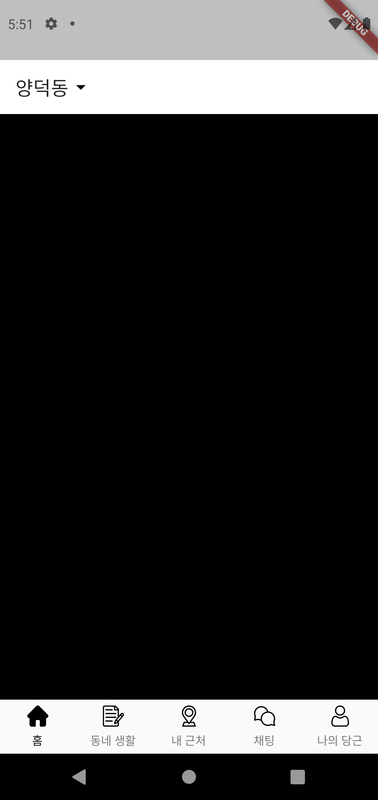

## 2.5. HomeScreen - ListView 만들기
### 2.5.1. Data List 변수 선언
`/lib/screens/home_screen.dart`
```dart
class _HomeScreenState extends State<HomeScreen> {
  // 여기부터
  List<Map<String, String>> data = [];

  @override
  void initState() {
    data = [
      {
        "image": "assets/images/ara-1.jpg",
        "title": "네메시스 축구화275",
        "location": "팡주팡역시 서구 화정동",
        "price": "30000",
        "likes": "2"
      },
      {
        "image": "assets/images/ara-2.jpg",
        "title": "LA갈비 5kg팔아요~",
        "location": "팡주팡역시 서구 풍암동",
        "price": "100000",
        "likes": "5"
      },
      {
        "image": "assets/images/ara-3.jpg",
        "title": "치약팝니다",
        "location": "팡주팡역시 서구 봉선동",
        "price": "5000",
        "likes": "0"
      },
      {
        "image": "assets/images/ara-4.jpg",
        "title": "[풀박스]맥북프로16인치 터치바 스페이스그레이 256GB",
        "location": "팡주팡역시 서구 임암동",
        "price": "2500000",
        "likes": "6"
      },
      {
        "image": "assets/images/ara-5.jpg",
        "title": "디월트존기임팩",
        "location": "팡주팡역시 광산구 신촌동",
        "price": "150000",
        "likes": "2"
      },
      {
        "image": "assets/images/ara-6.jpg",
        "title": "갤럭시s10",
        "location": "팡주팡역시 서구 화정동",
        "price": "180000",
        "likes": "2"
      },
      {
        "image": "assets/images/ara-7.jpg",
        "title": "선반",
        "location": "팡주팡역시 서구 화정동",
        "price": "15000",
        "likes": "2"
      },
      {
        "image": "assets/images/ara-8.jpg",
        "title": "냉장 쇼케이스",
        "location": "팡주팡역시 북구 용봉동",
        "price": "80000",
        "likes": "3"
      },
      {
        "image": "assets/images/ara-9.jpg",
        "title": "대우 미니냉장고",
        "location": "팡주팡역시 서구 화정동",
        "price": "30000",
        "likes": "3"
      },
      {
        "image": "assets/images/ara-10.jpg",
        "title": "멜킨스 풀업 턱걸이 판매합니다.",
        "location": "팡주팡역시 서구 풍암동",
        "price": "50000",
        "likes": "7"
      },
    ];
    super.initState();
  }
  // 여기까지
  @override
  Widget build(BuildContext context) {
    return Container(
      color: Colors.black,
    );
  }
}
```

### 2.5.2. ListView 위젯 사용하기
아래 코드를 `build()` 아래에 복붙

`/lib/screens/home_screen.dart -> _HomeScreenState -> _bodywidget()`
```dart
  Widget _bodyWidget() {
    return ListView.separated(
      padding: const EdgeInsets.symmetric(horizontal: 10),
      itemBuilder: (BuildContext _context, int index) {
        return GestureDetector(
          onTap: () {
            print(data[index]['title']);
          },
          child: Container(
            padding: const EdgeInsets.symmetric(vertical: 10),
            height: 110,
            child: Row(
              children: [
                ClipRRect(
                  borderRadius: BorderRadius.all(
                    Radius.circular((10)),
                  ),
                  child: Hero(
                    tag: "${data[index]["cid"]}",
                    child: Image.asset(
                      "${data[index]["image"]}",
                    ),
                  ),
                ),
                Expanded(
                  child: Container(
                    padding: const EdgeInsets.only(left: 20),
                    height: 100,
                    child: Column(
                      crossAxisAlignment: CrossAxisAlignment.start,
                      children: [
                        Text(
                          "${data[index]["title"]}",
                          style: TextStyle(fontSize: 15),
                          overflow: TextOverflow.ellipsis,
                        ),
                        SizedBox(height: 5),
                        Text(
                          "${data[index]["location"]}",
                          style: TextStyle(
                            fontSize: 13,
                            color: Colors.black.withOpacity(0.3),
                          ),
                        ),
                        SizedBox(height: 5),
                        Text(
                          DataUtils.calcStringToWon(
                              data[index]["price"].toString()),
                          style: TextStyle(fontWeight: FontWeight.w500),
                        ),
                        Expanded(
                          child: Row(
                            mainAxisAlignment: MainAxisAlignment.end,
                            crossAxisAlignment: CrossAxisAlignment.end,
                            children: [
                              SvgPicture.asset(
                                "assets/svg/heart_off.svg",
                                height: 13,
                                width: 13,
                              ),
                              SizedBox(width: 5),
                              Text("${data[index]["likes"]}"),
                            ],
                          ),
                        ),
                      ],
                    ),
                  ),
                ),
              ],
            ),
          ),
        );
      },
      separatorBuilder: (BuildContext _context, int index) {
        return Container(
          height: 1,
          color: Colors.black.withOpacity(0.4),
        );
      },
      itemCount: data.length,
    );
  }
```
`/lib/home_screen.dart -> build()` 수정
```dart
  @override
  Widget build(BuildContext context) {
    return Scaffold(        // NEW
      body: _bodyWidget(),  // NEW
    );                      // NEW
  }
```
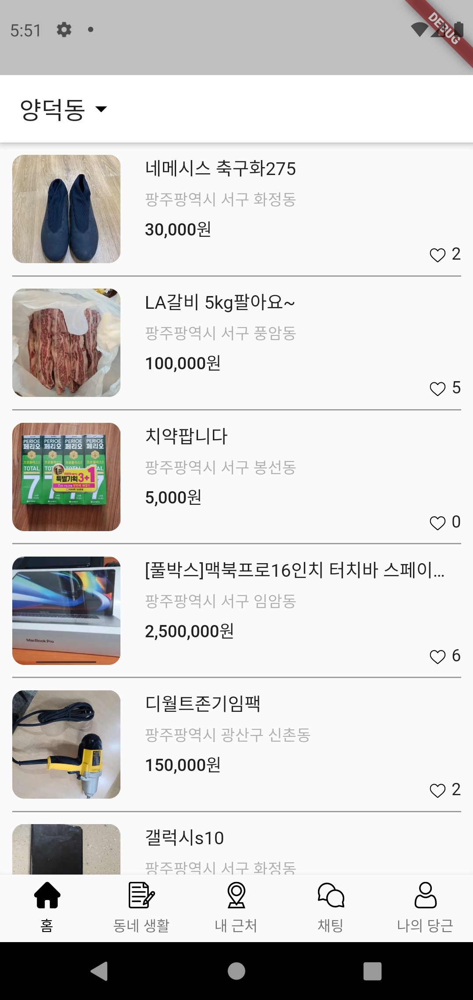

## 2.6. Home Screen - AppBar 수정
`/lib/screens/app_screen.dart -> build()` 수정
```dart
@override
  Widget build(BuildContext context) {
    return Scaffold(
      body: _bodyWidget(),
      bottomNavigationBar: _bottomNavigationBarWidget(),
    );
  }
```
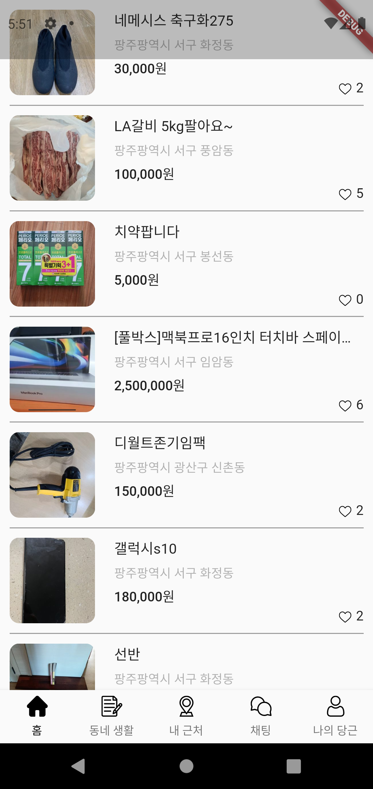

`/lib/screens/home_screen.dart -> _HomeScreenState -> build()` 수정

```dart
@override
  Widget build(BuildContext context) {
    return Scaffold(
      appBar: _appBarWidget(), // NEW
      body: _bodyWidget(),
    );
  }
```

```dart
AppBar _appBarWidget() {
  return AppBar(
      title: PopupMenuButton<String>(
        offset: Offset(0, 30),
        shape: ShapeBorder.lerp(
            RoundedRectangleBorder(borderRadius: BorderRadius.circular(10.0)),
            RoundedRectangleBorder(borderRadius: BorderRadius.circular(10.0)),
            1),
        onSelected: (String where) {
          print(where);
          setState(() {
            _currentLocation = where;
          });
        },
        itemBuilder: (BuildContext context) {
          return [
            PopupMenuItem(
              value: "ara",
              child: Text('아라동'),
            ),
            PopupMenuDivider(
              height: 1.0,
            ),
            PopupMenuItem(
              value: "ora",
              child: Text('오라동'),
            ),
            PopupMenuDivider(
              height: 1.0,
            ),
            PopupMenuItem(
              value: "donam",
              child: Text('도남동'),
            ),
          ];
        },
        child: Row(
          children: [
            Text(
              "${locationTypeToString[_currentLocation]}",
            ),
            Icon(Icons.arrow_drop_down)
          ],
        ),
      ),
      elevation: 1,
      actions: [
        IconButton(
          onPressed: () {},
          icon: Icon(Icons.search),
        ),
        IconButton(
          onPressed: () {},
          icon: Icon(Icons.tune),
        ),
        IconButton(
            onPressed: () {},
            icon: SvgPicture.asset(
              'assets/svg/bell.svg',
              width: 22,
            )),
      ],
    );
}
```


### 2.6.1. Pop Up Menu Event 처리
`/lib/screens/home_screen.dart -> _HomeScreenState`  
Data Repository 불러오기
```dart
...
late ContentsRepository _contentsRepository; // NEW

@override
  void initState() {
    super.initState();
    _currentLocation = 'ara';
    _contentsRepository = ContentsRepository(); // NEW
  }
...
```

`/lib/screens/home_screen.dart -> _HomeScreenState -> _bodyWidget()` 수정
```dart
Widget _bodyWidget() {
    return FutureBuilder(
      future: _contentsRepository.loadContentsFromLocation(_currentLocation),
      builder: (context, snapshot) {
        if (snapshot.connectionState != ConnectionState.done) {
          return Center(
            child: CircularProgressIndicator(),
          );
        } else if (snapshot.hasError) {
          if (snapshot.error.toString() == "Exception: Data is Null") {
            return Center(
              child: Text('해당 지역에 데이터가 없습니다.'),
            );
          }
          return Center(
            child: Text('데이터 오류'),
          );
        } else if (snapshot.hasData) {
          return _makeDataList(snapshot.data as List<Map<String, String>>);
        }

        return Center(
          child: CircularProgressIndicator(),
        );
      },
    );
  }
```
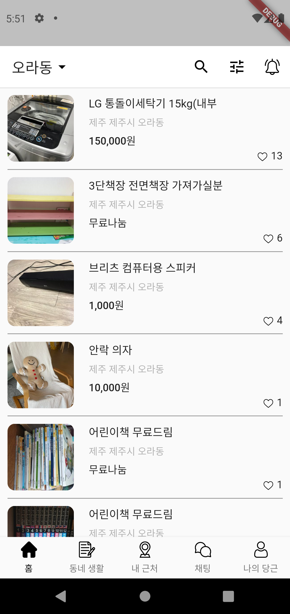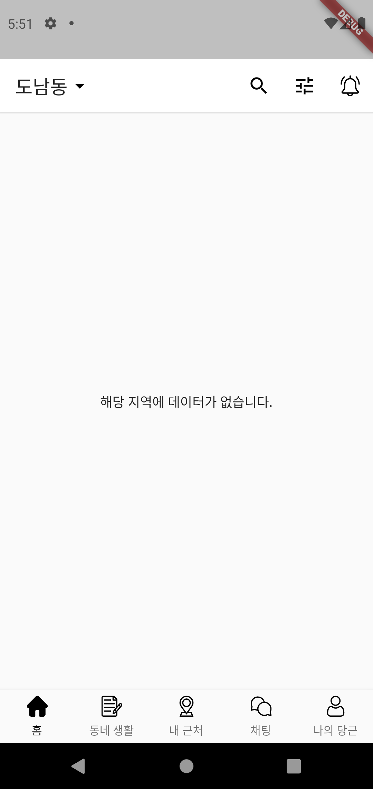

## 2.7. Detail Screen 만들기
`/lib/screens/detail_screen.dart` 생성  
`StatefullWidget` 으로 `DeatailScreen` Class 생성

`/lib/screens/detail_screen.dart`
```dart
import 'package:flutter/material.dart';

class DetailScreen extends StatefulWidget {
  const DetailScreen({Key? key}) : super(key: key);

  @override
  _DetailScreenState createState() => _DetailScreenState();
}

class _DetailScreenState extends State<DetailScreen> {
  @override
  Widget build(BuildContext context) {
    return Scaffold(
      appBar: AppBar(
        title: Text('Detail'),
      ),
      body: Container(color: Colors.blue),
      bottomNavigationBar: Container(
          height: 100,
          color: Colors.red
        )
    );
  }
}
```
### 2.7.1. HomeScreen -> DestailScreen Route
`/lib/screens/home_screen.dart -> _HomeScreenState -> _makeDataList()`
```dart
  Widget _makeDataList(List<Map<String, String>> data) {
    return ListView.separated(
      padding: const EdgeInsets.symmetric(horizontal: 10),
      itemBuilder: (BuildContext _context, int index) {
        return GestureDetector(
          onTap: () {
            // 여기부터
            Navigator.push(
              context,
              MaterialPageRoute(builder: (context) => DetailScreen()),
            );
            // 여기까지
            print(data[index]['title']);
          },
```
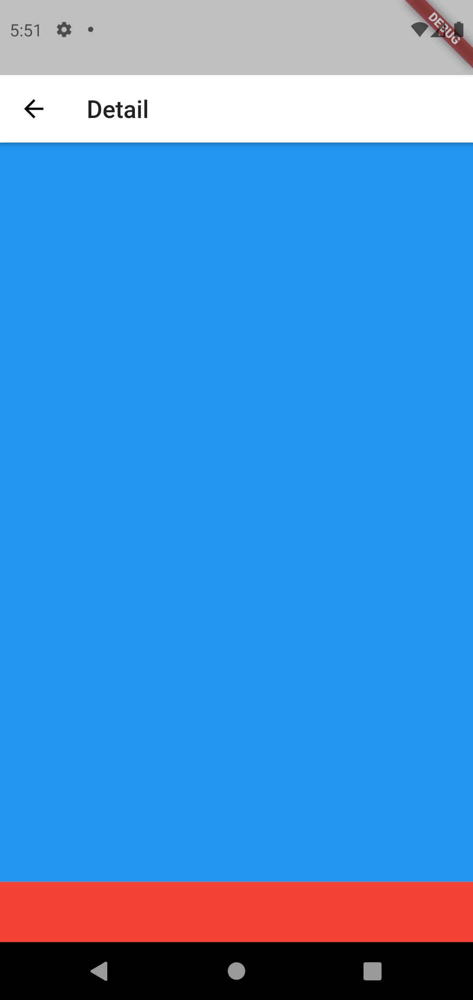

### 2.7.2. Detail Screen - Body 만들기
`caraousel_slider` 패키지 다운로드
```
$ flutter pub add carousel_slider
$ flutter pub get
```

`/lib/screens/detail_screen.dart`   
`DetailScreen` 수정

```dart
import 'package:carousel_slider/carousel_slider.dart';
import 'package:carrot_clone/components/manner_temparature.dart';
import 'package:carrot_clone/repositories/contents_repository.dart';
import 'package:carrot_clone/utils/data_utils.dart';
import 'package:flutter/material.dart';
import 'package:flutter_svg/svg.dart';

class DetailScreen extends StatefulWidget {
  final String cid;
  final String image;
  final String title;
  final String location;
  final String price;
  final String likes;

  const DetailScreen(
      {Key? key,
      required this.cid,
      required this.image,
      required this.title,
      required this.location,
      required this.price,
      required this.likes})
      : super(key: key);

  @override
  _DetailScreenState createState() => _DetailScreenState();
}

class _DetailScreenState extends State<DetailScreen>
    with SingleTickerProviderStateMixin {
  late Map<String, String> data;
  late ContentsRepository _contentsRepository;
  late Size size;
  List<String> imgList = [];
  late int _currentIndex;
  double scrollPositionToAlpha = 0;
  ScrollController _appBarScrollController = ScrollController();
  late AnimationController _appBarAnimationController;
  late Animation _colorTween;
  late bool _isMyFavoriteContent;

  @override
  void initState() {
    data = {
      "cid": widget.cid,
      "image": widget.image,
      "title": widget.title,
      "location": widget.location,
      "price": widget.price,
      "likes": widget.likes
    };
    _isMyFavoriteContent = false;
    _appBarAnimationController = AnimationController(vsync: this);
    _colorTween = ColorTween(
      begin: Colors.white,
      end: Colors.black,
    ).animate(_appBarAnimationController);
    _appBarScrollController.addListener(() {
      setState(() {
        if (_appBarScrollController.offset > 255)
          scrollPositionToAlpha = 255;
        else
          scrollPositionToAlpha = _appBarScrollController.offset;
        _appBarAnimationController.value = scrollPositionToAlpha / 255;
      });
    });
    _contentsRepository = ContentsRepository();
    _loadMyFavoriteContentState();
    super.initState();
  }

  _loadMyFavoriteContentState() async {
    bool checkIsMyFavorite =
        await _contentsRepository.isMyFavoriteContents("${data['cid']}");
    setState(() {
      _isMyFavoriteContent = checkIsMyFavorite;
    });
  }

  @override
  void didChangeDependencies() {
    super.didChangeDependencies();
    size = MediaQuery.of(context).size;
    imgList = [
      "${data['image']}",
      "${data['image']}",
      "${data['image']}",
      "${data['image']}",
    ];
    _currentIndex = 0;
  }

  @override
  Widget build(BuildContext context) {
    return Scaffold(
      appBar: AppBar(
        title: Text('Detail'),
      ),
      body: Container(color: Colors.blue),
      bottomNavigationBar: Container(
          height: 100,
          color: Colors.red
        )
    );
  }

  Widget _bodyWidget() {
    return CustomScrollView(
      controller: _appBarScrollController,
      slivers: [
        SliverList(
          delegate: SliverChildListDelegate(
            [
              _makeSliderImage(),
              _sellerSimpleInfo(),
              Divider(height: 1, thickness: 1),
              _contentDetail(),
              Divider(height: 1, thickness: 1),
              _otherSellContents(),
            ],
          ),
        ),
        SliverPadding(
          padding: const EdgeInsets.symmetric(horizontal: 15.0),
          sliver: SliverGrid(
            gridDelegate: SliverGridDelegateWithFixedCrossAxisCount(
              crossAxisCount: 2,
              mainAxisSpacing: 10,
              crossAxisSpacing: 10,
            ),
            delegate: SliverChildListDelegate(
              List.generate(20, (index) {
                return Container(
                  child: Column(
                    crossAxisAlignment: CrossAxisAlignment.stretch,
                    children: [
                      ClipRRect(
                        borderRadius: BorderRadius.circular(10.0),
                        child: Container(
                          color: Colors.grey,
                          height: 120,
                        ),
                      ),
                      Text("상품 제목", style: TextStyle(fontSize: 14.0)),
                      Text("금액",
                          style: TextStyle(
                              fontSize: 14.0, fontWeight: FontWeight.bold)),
                    ],
                  ),
                );
              }).toList(),
            ),
          ),
        )
      ],
    );
  }

  Widget _makeSliderImage() {
    return Container(
      child: Stack(
        children: [
          Hero(
            tag: "${data['cid']}",
            // Hero애니메이션 도중에 발생하는 오버플로우 때문에 애니매이션 동작 재정의
            flightShuttleBuilder: (
              BuildContext flightContext,
              Animation<double> animation,
              HeroFlightDirection flightDirection,
              BuildContext fromHeroContext,
              BuildContext toHeroContext,
            ) {
              return SingleChildScrollView(
                // fromHeroContext: 시작크기로 애니메이션 진행, toHeroContext: 끝크기로 애니메이션 진행
                child: toHeroContext.widget,
              );
            },
            child: Container(
              child: CarouselSlider(
                items: imgList.map((url) {
                  return Column(
                    children: [
                      Image.asset(
                        url,
                        width: size.width,
                        fit: BoxFit.fill,
                      ),
                    ],
                  );
                }).toList(),
                options: CarouselOptions(
                    height: size.width,
                    initialPage: 0,
                    enableInfiniteScroll: false,
                    viewportFraction: 1,
                    onPageChanged: (index, reason) {
                      setState(() {
                        _currentIndex = index;
                      });
                    }),
              ),
            ),
          ),
          Positioned(
            bottom: 0,
            left: 0,
            right: 0,
            child: Row(
              mainAxisAlignment: MainAxisAlignment.center,
              children: imgList.asMap().entries.map((entry) {
                return Container(
                  width: 10.0,
                  height: 10.0,
                  margin: EdgeInsets.symmetric(vertical: 10.0, horizontal: 5.0),
                  decoration: BoxDecoration(
                      shape: BoxShape.circle,
                      color: Colors.white
                          .withOpacity(_currentIndex == entry.key ? 0.9 : 0.4)),
                );
              }).toList(),
            ),
          ),
        ],
      ),
    );
  }

  Widget _sellerSimpleInfo() {
    return Padding(
      padding: const EdgeInsets.all(15.0),
      child: Row(
        children: [
          CircleAvatar(
            radius: 35,
            backgroundImage: Image.asset("assets/images/user.png").image,
          ),
          SizedBox(width: 10.0),
          Column(
            crossAxisAlignment: CrossAxisAlignment.start,
            children: [
              Text(
                "개발하는곰",
                style: TextStyle(
                  fontWeight: FontWeight.bold,
                  fontSize: 16,
                ),
              ),
              Text("포항시 양덕동"),
            ],
          ),
          Expanded(
            child: MannerTemperature(mannerTemperature: 37.5),
          ),
        ],
      ),
    );
  }

  Widget _contentDetail() {
    return Container(
      margin: const EdgeInsets.symmetric(horizontal: 15.0),
      child: Column(
        crossAxisAlignment: CrossAxisAlignment.stretch,
        children: [
          SizedBox(height: 20.0),
          Text(
            "${data["title"]}",
            style: TextStyle(
              fontWeight: FontWeight.bold,
              fontSize: 20,
            ),
          ),
          Text(
            "디지털/가전 ・ 22시간 전",
            style: TextStyle(
              color: Colors.grey,
              fontSize: 12,
            ),
          ),
          SizedBox(height: 15.0),
          Text(
            "선물 받은 새상품 입니다.\n상품 꺼내보기만 했습니다.\n거래는 직거래만 합니다.",
            style: TextStyle(
              fontSize: 15,
              height: 1.5,
            ),
          ),
          SizedBox(height: 15.0),
          Text(
            "채팅 3 ・ 관심 17 ・ 조회 235",
            style: TextStyle(
              fontSize: 12,
              color: Colors.grey,
            ),
          ),
          SizedBox(height: 15.0),
        ],
      ),
    );
  }

  Widget _otherSellContents() {
    return Padding(
      padding: const EdgeInsets.all(15.0),
      child: Row(
        mainAxisAlignment: MainAxisAlignment.spaceBetween,
        children: [
          Text(
            "판매자의 다른 판매 상품",
            style: TextStyle(
              fontSize: 15,
              fontWeight: FontWeight.bold,
            ),
          ),
          Text(
            "모두보기",
            style: TextStyle(
              fontSize: 12,
              fontWeight: FontWeight.bold,
            ),
          ),
        ],
      ),
    );
  }
}

```

`MannerTemperature` 만들기
`lib/components/manner_temparature.dart`

```dart
import 'package:flutter/material.dart';

class MannerTemperature extends StatelessWidget {
  double mannerTemperature;
  late int level;
  MannerTemperature({Key? key, required this.mannerTemperature}) {
    _calcTempLevel();
  }

  void _calcTempLevel() {
    if (20 >= mannerTemperature) {
      level = 0;
    } else if (20 < mannerTemperature && 32 >= mannerTemperature) {
      level = 1;
    } else if (32 < mannerTemperature && 36.5 >= mannerTemperature) {
      level = 2;
    } else if (36.5 < mannerTemperature && 40 >= mannerTemperature) {
      level = 3;
    } else if (40 < mannerTemperature && 50 >= mannerTemperature) {
      level = 4;
    } else if (50 < mannerTemperature) {
      level = 5;
    }
  }

  final List<Color> tempPerColors = [
    Color(0xff072038),
    Color(0xff0d3a65),
    Color(0xff186ec0),
    Color(0xff37b24d),
    Color(0xffffad13),
    Color(0xfff76707),
  ];

  Widget _makeTempLabelAndBar() {
    return Container(
      width: 65,
      child: Column(
        crossAxisAlignment: CrossAxisAlignment.stretch,
        children: [
          Text(
            "$mannerTemperature°C",
            style: TextStyle(
              color: tempPerColors[level],
              fontSize: 18,
              fontWeight: FontWeight.bold,
            ),
          ),
          ClipRRect(
            borderRadius: BorderRadius.circular(10),
            child: Container(
              height: 6,
              color: Colors.black.withOpacity(0.2),
              child: Row(
                children: [
                  Container(
                    height: 6,
                    width: 65 / 99 * mannerTemperature,
                    color: tempPerColors[level],
                  ),
                ],
              ),
            ),
          )
        ],
      ),
    );
  }

  Widget _makeTempToCharactorIcon() {
    return Container(
      width: 30,
      height: 30,
      child: Image.asset("assets/images/level-$level.jpg"),
    );
  }

  @override
  Widget build(BuildContext context) {
    return Container(
      child: Column(
        crossAxisAlignment: CrossAxisAlignment.end,
        children: [
          Row(
            mainAxisAlignment: MainAxisAlignment.end,
            children: [
              _makeTempLabelAndBar(),
              SizedBox(width: 7),
              _makeTempToCharactorIcon(),
            ],
          ),
          SizedBox(height: 5),
          Text(
            "매너온도",
            style: TextStyle(
                decoration: TextDecoration.underline,
                fontSize: 12,
                color: Colors.grey),
          )
        ],
      ),
    );
  }
}

```

`/lib/screens/home_screen.dart _HomeScreeState -> _makeDataList()`

```dart
...
Widget _makeDataList(List<Map<String, String>> data) {
    return ListView.separated(
      padding: const EdgeInsets.symmetric(horizontal: 10),
      itemBuilder: (BuildContext _context, int index) {
        return GestureDetector(
          onTap: () {
            Navigator.push(
              context,
              MaterialPageRoute(
                // 여기부터
                  builder: (context) => DetailScreen(
                      cid: "${data[index]['cid']}",
                      image: "${data[index]['image']}",
                      title: "${data[index]['title']}",
                      location: "${data[index]['location']}",
                      price: "${data[index]['price']}",
                      likes: "${data[index]['likes']}")),
                // 여기까지
            );
            print(data[index]['title']);
          },
...
```
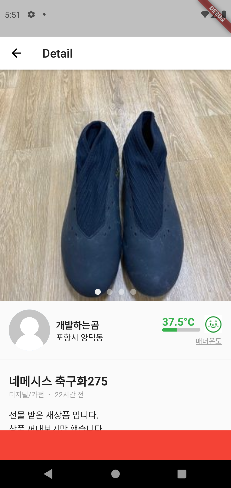

### 2.7.3. Detail Screen - BottomNavigation 만들기

```dart
Widget _bottomNavigationBarWidget() {
    return Container(
      padding: const EdgeInsets.symmetric(horizontal: 15.0),
      width: size.width,
      height: 55,
      child: Row(
        children: [
          GestureDetector(
            onTap: () async {
              _isMyFavoriteContent
                  ? await _contentsRepository
                      .deleteMyFavoriteContent("${data['cid']}")
                  : await _contentsRepository.addMyFavoriteContent(data);
              setState(() {
                _isMyFavoriteContent = !_isMyFavoriteContent;
              });
              print("관심상품이벤트발생");
            },
            child: SvgPicture.asset(
              _isMyFavoriteContent
                  ? "assets/svg/heart_on.svg"
                  : "assets/svg/heart_off.svg",
              width: 20,
              height: 20,
              color: Color(0xfff08f4f),
            ),
          ),
          SizedBox(width: 15),
          VerticalDivider(width: 1, thickness: 1.0),
          SizedBox(width: 15),
          Column(
            children: [
              Text(
                DataUtils.calcStringToWon("${data["price"]}"),
                style: TextStyle(
                  fontSize: 17,
                  fontWeight: FontWeight.bold,
                ),
              ),
              Text(
                "가격제안불가",
                style: TextStyle(
                  fontSize: 14,
                  color: Colors.grey,
                ),
              )
            ],
          ),
          Expanded(
            child: Row(
              mainAxisAlignment: MainAxisAlignment.end,
              children: [
                Container(
                  padding: const EdgeInsets.symmetric(
                      horizontal: 10.0, vertical: 7.0),
                  decoration: BoxDecoration(
                    borderRadius: BorderRadius.circular(5),
                    // BoxDecoration 사용시에는 color를 BoxDecoration 안에 설정해줘야 함.
                    color: Color(0xfff08f4f),
                  ),
                  child: Text(
                    "채팅으로 거래하기",
                    style: TextStyle(
                      color: Colors.white,
                      fontSize: 16.0,
                      fontWeight: FontWeight.bold,
                    ),
                  ),
                ),
              ],
            ),
          ),
        ],
      ),
    );
  }
```
`/lib/screens/detail_screen -> build()`
```dart
@override
  Widget build(BuildContext context) {
    return Scaffold(
      appBar: AppBar(
        title: Text('Detail'),
      ),
      body: _bodyWidget(),
      bottomNavigationBar: _bottomNavigationBarWidget(), // NEW
    );
  }
```
### 2.7.4. Detail Screen - AppBar 만들기

```dart
AppBar _appBarWidget() {
    return AppBar(
      backgroundColor: Colors.white.withAlpha(scrollPositionToAlpha.toInt()),
      elevation: 0,
      leading: IconButton(
        onPressed: () {
          Get.back();
        },
        icon: _makeAnimatedIcon(Icons.arrow_back),
      ),
      actions: [
        IconButton(
          onPressed: () {},
          icon: _makeAnimatedIcon(Icons.share_outlined),
        ),
        IconButton(
          onPressed: () {},
          icon: _makeAnimatedIcon(Icons.more_vert),
        ),
      ],
    );
  }

```

```dart
Widget _makeAnimatedIcon(IconData iconData) {
    return AnimatedBuilder(
      animation: _colorTween,
      builder: (context, child) => Icon(
        iconData,
        color: _colorTween.value,
      ),
    );
  }
```

```dart
 @override
  Widget build(BuildContext context) {
    return Scaffold(
      extendBodyBehindAppBar: true, // NEW
      appBar: _appBarWidget(),  // NEW
      body: _bodyWidget(),
      bottomNavigationBar: _bottomNavigationBarWidget(),
    );
  }
```
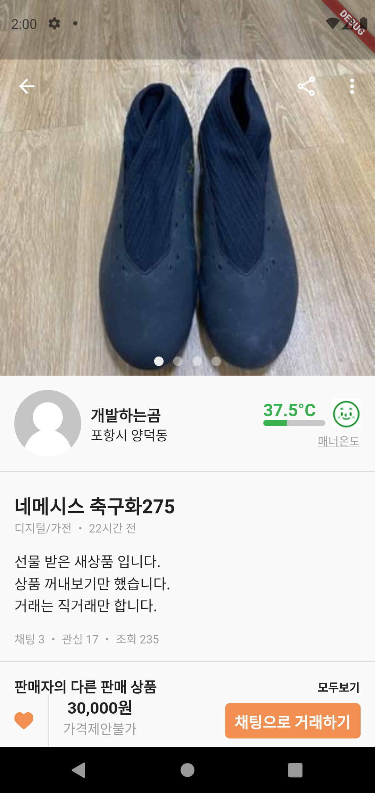

## 2.8 관심 목록
`/lib/screens/app_screen.dart -> _bodyWidget()`

```dart
Widget _bodyWidget() {
    switch (_currentPageIndex) {
      case 0: // 홈
        return HomeScreen();
      case 1: // 동네 생활
        return Center(
          child: Text('동네 생활'),
        );
      case 2: // 내 근처
        return Center(
          child: Text('내 근처'),
        );
      case 3: // 채팅
        return Center(
          child: Text('채팅'),
        );
      case 4: // 나의 당근
        return MyFavoriteScreen(); // NEW
    }
    return Container();
  }
```

`/lib/screens/favorite_screen.dart`

```dart
import 'package:carrot_clone/repositories/contents_repository.dart';
import 'package:carrot_clone/screens/detail_screen.dart';
import 'package:carrot_clone/utils/data_utils.dart';
import 'package:flutter/cupertino.dart';
import 'package:flutter/material.dart';
import 'package:flutter_svg/svg.dart';

class MyFavoriteScreen extends StatefulWidget {
  const MyFavoriteScreen({Key? key}) : super(key: key);

  @override
  _MyFavoriteScreenState createState() => _MyFavoriteScreenState();
}

class _MyFavoriteScreenState extends State<MyFavoriteScreen> {
  late ContentsRepository contentsRepository;

  @override
  void initState() {
    contentsRepository = ContentsRepository();
    super.initState();
  }

  @override
  Widget build(BuildContext context) {
    return Scaffold(
      appBar: _appBarWidget(),
      body: _bodyWidget(),
    );
  }

  AppBar _appBarWidget() {
    return AppBar(
      elevation: 1,
      title: Text(
        "관심목록",
        style: TextStyle(fontSize: 15),
      ),
    );
  }

  Widget _bodyWidget() {
    return FutureBuilder(
      future: _loadMyFavoriteContentsList(),
      builder: (context, snapshot) {
        if (snapshot.connectionState != ConnectionState.done) {
          return Center(
            child: CircularProgressIndicator(),
          );
        } else if (snapshot.hasError) {
          if (snapshot.error.toString() == "Exception: Data is Null") {
            return Center(
              child: Text('해당 데이터가 없습니다.'),
            );
          }
          return Center(
            child: Text('데이터 오류'),
          );
        } else if (snapshot.hasData) {
          return snapshot.data.toString() == '[]'
              ? Center(child: Text('해당 데이터가 없습니다.'))
              : _makeDataList(snapshot.data as List<dynamic>);
        }

        return Center(
          child: CircularProgressIndicator(),
        );
      },
    );
  }

  Future<dynamic> _loadMyFavoriteContentsList() async {
    return await contentsRepository.loadMyFavoriteContents();
  }

  _makeDataList(List<dynamic> data) {
    return ListView.separated(
      padding: const EdgeInsets.symmetric(horizontal: 10),
      itemBuilder: (BuildContext _context, int index) {
        return GestureDetector(
          onTap: () {
            Navigator.push(
                context,
                MaterialPageRoute(
                    builder: (context) => DetailScreen(
                        cid: "${data[index]['cid']}",
                        image: "${data[index]['image']}",
                        title: "${data[index]['title']}",
                        location: "${data[index]['location']}",
                        price: "${data[index]['price']}",
                        likes: "${data[index]['likes']}")));
            print(data[index]['title']);
          },
          child: Container(
            padding: const EdgeInsets.symmetric(vertical: 10),
            height: 100,
            child: Row(
              children: [
                ClipRRect(
                  borderRadius: BorderRadius.all(
                    Radius.circular((10)),
                  ),
                  child: Hero(
                    tag: "${data[index]["cid"]}",
                    child: Image.asset(
                      "${data[index]["image"]}",
                    ),
                  ),
                ),
                Expanded(
                  child: Container(
                    padding: const EdgeInsets.only(left: 20),
                    height: 100,
                    child: Column(
                      crossAxisAlignment: CrossAxisAlignment.start,
                      children: [
                        Text(
                          "${data[index]["title"]}",
                          style: TextStyle(fontSize: 15),
                          overflow: TextOverflow.ellipsis,
                        ),
                        SizedBox(height: 5),
                        Text(
                          "${data[index]["location"]}",
                          style: TextStyle(
                            fontSize: 13,
                            color: Colors.black.withOpacity(0.3),
                          ),
                        ),
                        SizedBox(height: 5),
                        Text(
                          DataUtils.calcStringToWon(
                              data[index]["price"].toString()),
                          style: TextStyle(fontWeight: FontWeight.w500),
                        ),
                        Expanded(
                          child: Row(
                            mainAxisAlignment: MainAxisAlignment.end,
                            crossAxisAlignment: CrossAxisAlignment.end,
                            children: [
                              SvgPicture.asset(
                                "assets/svg/heart_off.svg",
                                height: 13,
                                width: 13,
                              ),
                              SizedBox(width: 5),
                              Text("${data[index]["likes"]}"),
                            ],
                          ),
                        ),
                      ],
                    ),
                  ),
                ),
              ],
            ),
          ),
        );
      },
      separatorBuilder: (BuildContext _context, int index) {
        return Container(
          height: 1,
          color: Colors.black.withOpacity(0.4),
        );
      },
      itemCount: data.length,
    );
  }
}

```


## 2.9 프로필 페이지 만들기
### 2.9.1. Route 설정
* `/lib/screens/app_screen.dart`

  ```dart
  Widget _bodyWidget() {
      switch (_currentPageIndex) {
        case 0: // 홈
          return HomeScreen();
        case 1: // 동네 생활
          return Center(
            child: Text('동네 생활'),
          );
        case 2: // 내 근처
          return Center(
            child: Text('내 근처'),
          );
        case 3: // 채팅
          return Center(
            child: Text('채팅'),
          );
        case 4: // 나의 당근
          return ProfileScreen(); // NEW
      }
      return Container();
    }
  ```
### 2.9.2. `/lib/screens/profile_screen.dart` 생성

```dart
import 'package:carrot_clone/screens/favorite_screen.dart';
import 'package:flutter/cupertino.dart';
import 'package:flutter/material.dart';
import 'package:flutter/widgets.dart';

class ProfileScreen extends StatelessWidget {
  const ProfileScreen({Key? key}) : super(key: key);

  @override
  Widget build(BuildContext context) {
    return Scaffold(
      appBar: AppBar(
        elevation: 1,
        title: Text(
          '나의 당근',
          style: TextStyle(fontWeight: FontWeight.bold),
        ),
        actions: [
          IconButton(
            onPressed: () {},
            icon: Icon(Icons.settings_outlined),
          ),
        ],
      ),
      body: ListView(
        children: [
          _makeMyInfo(context),
          Divider(
            height: 5.0,
            thickness: 5.0,
          ),
          _makeAppSettings(),
          Divider(
            height: 5.0,
            thickness: 5.0,
          ),
          _makeVillageInfo(),
          Divider(
            height: 5.0,
            thickness: 5.0,
          ),
          _makeAdInfo(),
          Divider(
            height: 5.0,
            thickness: 5.0,
          ),
          _makeBoard(),
        ],
      ),
    );
  }

  Widget _makeIconWithText(Icon iconName, String title) {
    return Row(
      children: [
        iconName,
        SizedBox(
          width: 15,
        ),
        Text(title),
      ],
    );
  }

  Widget _makeAppSettings() {
    return Container(
      height: 300,
      padding: const EdgeInsets.symmetric(horizontal: 8.0),
      child: Column(
        mainAxisAlignment: MainAxisAlignment.spaceAround,
        children: [
          _makeIconWithText(Icon(Icons.room), '내 동네 설정'),
          _makeIconWithText(Icon(Icons.gps_not_fixed), '동네 인증하기'),
          _makeIconWithText(Icon(Icons.local_offer), '키워드 알림'),
          _makeIconWithText(Icon(Icons.grid_view), '모아보기'),
          _makeIconWithText(Icon(Icons.tune), '관심 카테고리 설정'),
        ],
      ),
    );
  }

  Widget _makeVillageInfo() {
    return Container(
      height: 200,
      padding: const EdgeInsets.symmetric(horizontal: 8.0),
      child: Column(
        mainAxisAlignment: MainAxisAlignment.spaceAround,
        children: [
          _makeIconWithText(Icon(Icons.app_registration_outlined), '동네생활 글'),
          _makeIconWithText(Icon(Icons.maps_ugc_outlined), '동네생활 글'),
          _makeIconWithText(Icon(Icons.star_outlined), '동네생활 주제 목록'),
        ],
      ),
    );
  }

  Widget _makeAdInfo() {
    return Container(
      height: 200,
      padding: const EdgeInsets.symmetric(horizontal: 8.0),
      child: Column(
        mainAxisAlignment: MainAxisAlignment.spaceAround,
        children: [
          _makeIconWithText(Icon(Icons.storefront_outlined), '비즈프로필 만들기'),
          _makeIconWithText(Icon(Icons.article_outlined), '동네홍보 글'),
          _makeIconWithText(Icon(Icons.campaign_outlined), '지역광고'),
        ],
      ),
    );
  }

  Widget _makeBoard() {
    return Container(
      height: 300,
      padding: const EdgeInsets.symmetric(horizontal: 8.0),
      child: Column(
        mainAxisAlignment: MainAxisAlignment.spaceAround,
        children: [
          _makeIconWithText(Icon(Icons.mail_outlined), '친구초대'),
          _makeIconWithText(Icon(Icons.share_outlined), '당근마켓 공유'),
          _makeIconWithText(Icon(Icons.mic_none), '공지사항'),
          _makeIconWithText(Icon(Icons.support_agent), '자주 묻는 질문'),
          _makeIconWithText(Icon(Icons.settings_outlined), '앱 설'),
        ],
      ),
    );
  }

  Widget _makeMyInfo(BuildContext context) {
    return Container(
      padding: const EdgeInsets.symmetric(
        vertical: 16.0,
        horizontal: 10.0,
      ),
      color: Colors.white,
      child: Column(
        mainAxisAlignment: MainAxisAlignment.start,
        children: [
          Row(
            crossAxisAlignment: CrossAxisAlignment.start,
            children: [
              _makeProfileCircle(),
              Container(
                padding: const EdgeInsetsDirectional.only(start: 8.0),
                child: Column(
                  crossAxisAlignment: CrossAxisAlignment.start,
                  children: [
                    Text(
                      '오규찬',
                      style: TextStyle(
                        fontWeight: FontWeight.bold,
                      ),
                    ),
                    Text(
                      '양덕동#12345',
                      style:
                          TextStyle(fontSize: 10, fontWeight: FontWeight.w100),
                    ),
                  ],
                ),
              ),
            ],
          ),
          SizedBox(
            height: 15,
          ),
          Row(
            children: [
              Expanded(
                child: Container(
                  child: OutlinedButton(
                    onPressed: () {},
                    child: Text(
                      '프로필 보기',
                      style: TextStyle(color: Colors.black),
                    ),
                    style: ButtonStyle(
                      side: MaterialStateProperty.all(
                        BorderSide(
                          style: BorderStyle.solid,
                          color: Colors.grey,
                          width: 2.0,
                        ),
                      ),
                      overlayColor:
                          MaterialStateProperty.all(Colors.transparent),
                    ),
                  ),
                ),
              ),
            ],
          ),
          Row(
            mainAxisAlignment: MainAxisAlignment.spaceEvenly,
            children: [
              GestureDetector(
                child: Column(
                  children: [
                    CircleAvatar(
                      radius: 30.0,
                      backgroundColor: Colors.grey,
                    ),
                    Text('판매내역'),
                  ],
                ),
              ),
              GestureDetector(
                child: Column(
                  children: [
                    CircleAvatar(
                      radius: 30.0,
                      backgroundColor: Colors.grey,
                    ),
                    Text('구매내역'),
                  ],
                ),
              ),
              GestureDetector(
                onTap: () {
                  Navigator.push(context,
                      MaterialPageRoute(builder: (_) => MyFavoriteScreen()));
                },
                child: Column(
                  children: [
                    CircleAvatar(
                      radius: 30.0,
                      backgroundColor: Colors.grey,
                    ),
                    Text('관심목록'),
                  ],
                ),
              ),
            ],
          ),
        ],
      ),
    );
  }

  Widget _makeProfileCircle() {
    return Container(
      width: 80,
      height: 80,
      child: Stack(
        children: [
          Container(
            padding: const EdgeInsets.all(2.0),
            decoration: new BoxDecoration(
              color: Colors.grey,
              shape: BoxShape.circle,
            ),
            child: CircleAvatar(
              radius: 35,
              backgroundImage: Image.asset("assets/images/user.png").image,
            ),
          ),
          Positioned(
            right: 0,
            bottom: 0,
            child: Container(
              padding: const EdgeInsets.all(2.0),
              decoration: new BoxDecoration(
                color: Colors.grey,
                shape: BoxShape.circle,
              ),
              child: CircleAvatar(
                radius: 15,
                backgroundColor: Colors.white,
                child: Icon(
                  Icons.edit,
                  color: Colors.grey,
                ),
              ),
            ),
          )
        ],
      ),
    );
  }
}

```


# 3. 최종 결과


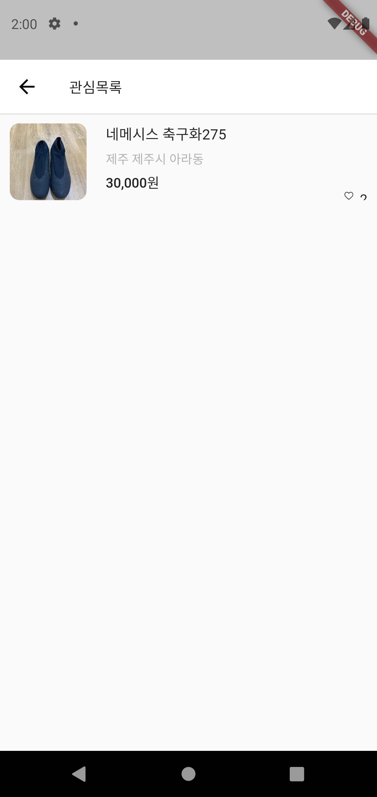

[Youtube 영상 자료](https://www.youtube.com/playlist?list=PLW-3bp81vhrdNVs2sNP51LY9C5RJw3cJI)
