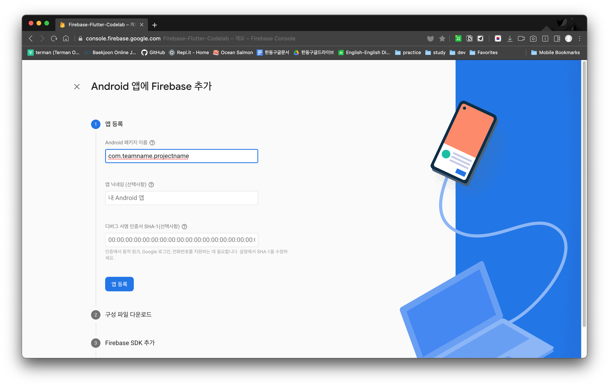
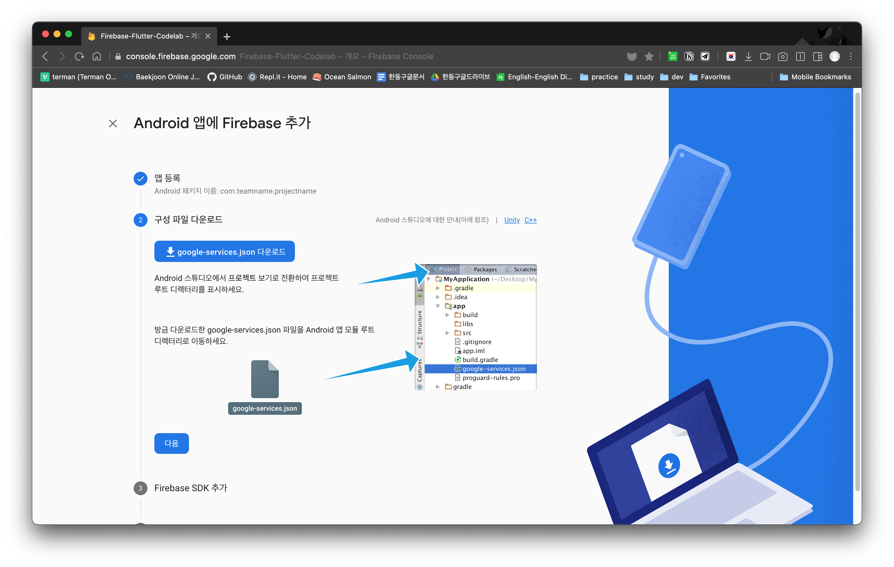

# Flutter Firebase 연동하기
## 1. [Firebase 프로젝트 만들기](https://firebase.google.com/)

## 2. Firebase에 앱 등록
> **중요**: Flutter 앱을 iOS와 Android에 모두 출시하는 경우 앱의 iOS와 Android 버전을 모두 **동일한 Firebase 프로젝트**에 등록해야 한다.

### 2.1. Android앱 등록
#### 2.1.1. [Firebase Consle](https://console.firebase.google.com/)의 프로젝트 개요 페이지 중앙에 있는 운영체제(Android)아이콘을 클릭.

#### 2.1.2. 앱 패키지명 입력
아래 화면처럼 Firebase에 등록할 Flutter 프로젝트의 패키지명을 입력하면 됩니다.

#### 2.1.2.1. 패키지명 확인

#### 2.1.2.2. 패키지명 변경
> 혹시나 패키지명을 잘못 입력하였거나, 패키지명을 변경하고 싶을 시에는 아래 순서를 따라서 작업! **중요: 아래 순서에서 하나라도 빠지면 앱이 Firebase와 연동이 안됩니다.**

#### 2.1.3. 구성파일 다운로드
다운로드한 `google-services.json` 파일을 `<project>/android/app/`에 저장

#### 2.1.4. FirebaseSDK등록
방금 다운로드한 `google-service.json` 파일을 로드하기 위한 플러그인을 사용하기 위해서 build.gradle파일을 수정.

프로젝트 수준의 `build.gradle` (&lt;project&gt;/android/build.gradle)에 자리에 맞춰서 아래 코드 복사, 붙여넣기
> `// Add this line` 주석이 달린 부분 복사, 붙여넣기

    buildscript {
        repositories {
            // Check that you have the following line (if not, add it):
            google()  // Google's Maven repository
        }
        dependencies {
            ...
            // Add this line
            classpath 'com.google.gms:google-services:4.3.8'
        }
    }

    allprojects {
    ...
        repositories {
            // Check that you have the following line (if not, add it):
            google()  // Google's Maven repository
            ...
        }
    }

앱 수준의 `build.gradle` (&lt;project&gt;/android/app/build.gradle)
> `// Add this line` 주석이 달린 부분 복사, 붙여넣기

    apply plugin: 'com.android.application'
    // Add this line
    apply plugin: 'com.google.gms.google-services'

    dependencies {
        // Import the Firebase BoM
        implementation platform('com.google.firebase:firebase-bom:28.2.0')

        // Add the dependencies for the desired Firebase products
        // https://firebase.google.com/docs/android/setup#available-libraries
    }

### 2.2. iOS앱 등록
#### 2.2.1. [Firebase Consle](https://console.firebase.google.com/)의 프로젝트 개요 페이지 좌측에 있는 운영체제(iOS)아이콘을 클릭.

## 3. Firebase에 데이터 추가 (Save Data to Firebase)

## 4. Firebase에서 데이터 로드 (Load Data from Firebase)

## 5. 보안 규칙 (Security Rules)