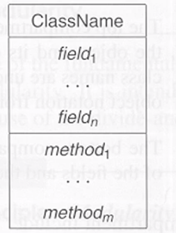
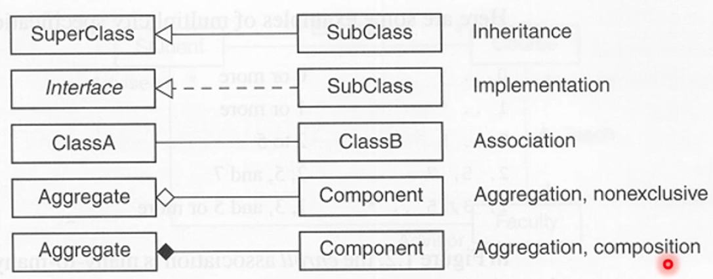

## 2. OODP Modeling
> UML: OMG(Object Management Group)에서 만든 표준 언어  
> 그래픽으로 표현  

## 2.1. Objects and Classes
||in real world|in model|
|-|-----|----|
|1. Object:| real world 에서 구별되고, 식별되는 모든 것. Object는 클래스의 Instance.|object는 고유한 정체성(상태와 behaviors)을 가진다.|
|2. Class:| 비슷한 특성과 행동을 가지는 object의 집합.|클래스의 모든 인스턴트들이 공유하는 상태와 behaviors를 characterize 한다.|
|

* Object
  * 고유한 identity 가진다
  * state: fields 또는 attributes와 attributes의 값들의 집합으로 이루어진
  * behavior: methods(operations)의 집합으로 정의된
  * features: 오브젝트의 state와 behavior의 조합을 참조

* Equal & Identical
  * Equal: 객체의 값이 같다.
  * Identical: 같은 객체이다.

* 객체의 field의 value는 mutable하다.
  * accessor: state를 수정하지 못하는 메소드.
  * mutator: 스테이트를 수정할 수 있는 메소드
  * mutable object: mutators를 갖고, 스테이트가 바뀔 수 있는 오브젝트
  * immutable: 스테이트가 바뀌지 않는 오브젝트, mutators를 갖지 않는 오브젝트

* Class
  * instance(오브젝트)를 생성하는 템플릿

* Visibility(or Accessibility)
  * public: 아무데서나
  * protected: 패키지나 subclass 안에서만
  * package: 패키지 안에서만
  * private: 클래스 안에서만

Class in UML

|visibility|java syntax|UML|
|--|--|--|
|public|public|+|
|protected| protected|#|
|package||~|
|private|private|-|

## 2.2. Object-Oriented Programming Principles

* 모듈화:
  * 프로그램을 모듈로 다 나누는 것.(divide and conquer), 모듈화가 잘 된 것은 모듈 안에서는 high cohesive, 모듈끼리는 loosely coupled, 즉 모듈 안에서는 각 entities들이 기능적으로 연관된 것, 모듈끼리는 상호작용이 적은 것.
* 추상화:
  * 본질적인 것만 추출하는 것, Contractual interface-어떻게 구현되었는지는 감추는 것, 사용자로 하여금 서비스 사용 매뉴얼만 알게하는 것, 충분히 필요한 정보만 끄집어내는 것.
  * 서비스하는 것을 나타낸 것 == SPEC
  * 어떻게 하는 것인지 그 방법 == Implementation
* 캡슐화:
  * 정보 은폐, public-private, 클래스 사용자가 알아야 될 것만 알면 되고, 클래스 안에 어떤 코드가 어떤 식으로 구현되어있느지는 몰라도 됨, implementation을 감추는 것 - information hiding.
* 캡슐화와 추상화:
  * 모듈 안에서 정보 은폐는 캡슐화, 모듈 밖에서 필요한 것만 보이게 하는 것은 추상화.
  * interface:
    * parent role of class
    * implements the contractual interface
* 다형성:
  * context에 따라서 다른 동작을 수행하는 것.

## 2.3. 모델링 관계 및 구조
* Class Diagram
  * Node: 클래스와 인터페이스를 나타낸다
  * Link: 클래스 간의 관계를 나타낸다.

* 클래스 간의 관계
  * Inheritance-상속:, including, extension, implementation
  * Association-연관: including aggregation, composition
  * Dependency-의존

* Inheritance
    * Extension relationship between two classes
    * Extension relationship between two interfaces
    * Implementation relation between a class and a interface
      * UML 표기
        * extension: specialization in UML
        * inverse of extension relation -> generalization in UML
        * implementation: realization in UML

* Multiple inheritance
  * in java: multiple implementation of multiple interfaces은 허용하지만 인터페이스가 아닌 것의 다중 상속은 안됨!

* Association
  * 연관관계
  * Multiplicity
  * 실선 혹은 화살표
  * 한 클래스가 다른 클래스에 기능을 사용하는 관계를 나타냄
  * Navigation arrow
    * A -> B, A는 B에 대한 정보를 attribute로 갖는다.
    * B는 A에 대한 정보를 갖지 않아서 A로 B를 찾아 낼 수 있지만
    * A는 B로 찾을 수 있음

* Generalization
* 일반화 관계
* 상속관계를 나타냄
* 속이 빈 화살표

* Aggregation & Composition
* 집홥관계
* 전체 또는 부분 관계를 나타냄
* Aggregation-집약관계
  * 속이 빈 다이아몬드
  * 전체 클래스와 부분 클래스의 lifetime이 독립접
  * Ex. 자동차와 타이어, 자동차가 없어도 타이어는 독립적으로 존재
* Composition-합성관계
  * 속이 찬 다이아몬드
  * 전체 클래스와 부분 클래스의 lifetime이 의존적
  * Ex. 학교와 학부의 관계, 학교가 없으면 학부도 존재할 수 없음.

